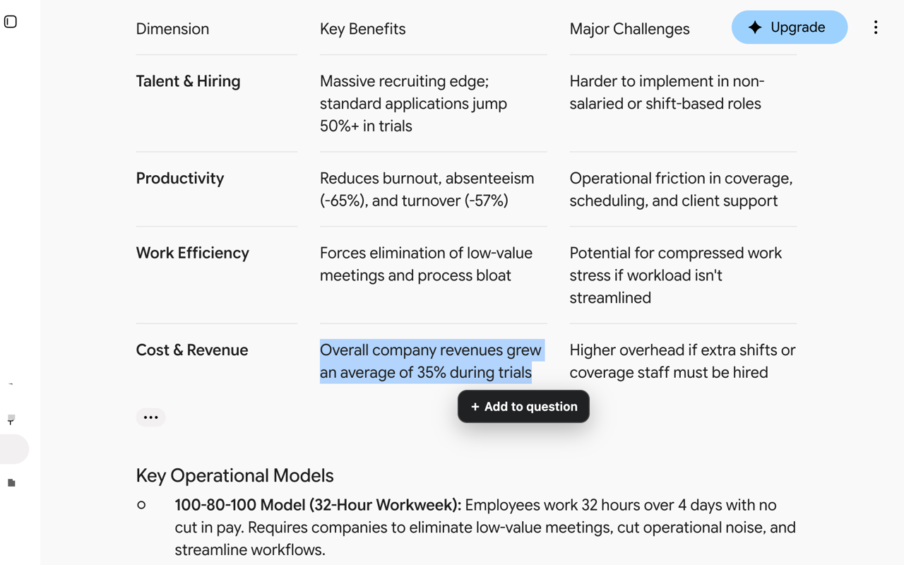

# AI Chat Annotations

A local Chrome extension for collecting multiple passages from earlier AI responses and including them in the next question. The same product flow works on ChatGPT and Gemini.



## What it does

1. Select text inside an assistant response.
2. Choose **＋ Add to question**.
3. Add an optional question or note in the editor beside that passage. Press Enter, Escape, or click away to minimize it to a numbered marker.
4. Repeat for every passage you want to reference. Select a marker to reopen or remove that reference.
5. Send normally—with or without additional text in the composer. The extension automatically includes the numbered passages and clears the markers only after the provider accepts the send.

There is deliberately no separate “Insert” step. The references are attached to the next normal question automatically.

## Install locally

Requires Node.js 20 or newer and a Chromium-based browser.

```bash
npm install
npm run build
```

Then in Chrome:

1. Open `chrome://extensions`.
2. Enable **Developer mode**.
3. Choose **Load unpacked**.
4. Select the generated `dist` directory in the project root.
5. Reload any already-open ChatGPT or Gemini tabs.

## Supported providers

- ChatGPT at `chatgpt.com` and `chat.openai.com`
- Gemini at `gemini.google.com`

The core reference store, highlighting, shelf, formatting, and send lifecycle are provider-independent. Each provider has its own adapter for response, composer, send-control, and conversation routing details. New providers should subclass `BaseAdapter` and register in `src/adapters/index.ts`.

## Safety and privacy

- The extension asks for no Chrome permissions.
- It makes no network requests and has no analytics.
- References remain in memory for the current page session and are separated by provider conversation.
- Text is added to the composer only when the user sends. If insertion or sending fails, the references remain available and a compact status appears.
- At most 20 passages can be queued; each passage is limited to 4,000 characters.

Read the full [Privacy Policy](PRIVACY.md). AI Chat Annotations is independent and unofficial; it is not affiliated with OpenAI or Google.

## Test

```bash
npm run check
npx playwright install chromium
npm run test:e2e
```

`npm run check` type-checks, runs the unit/integration suite, and creates the production build. The end-to-end suite launches the packaged Manifest V3 extension in an isolated Chromium profile and exercises the full multi-selection and automatic-send flow against both provider DOM contracts.

## Prepare a release

```bash
npm run release:check
```

This runs the complete verification suite, renders the Chrome Web Store promotional assets, validates the manifest and icons, and produces:

- `release/ai-chat-annotations-0.1.0.zip`
- `release/ai-chat-annotations-0.1.0.zip.sha256`

The Store submission copy, privacy answers, reviewer instructions, asset map, and manual checklist are under [`store-listing`](store-listing).

## Current boundaries

- Provider DOM changes may require a selector update in that provider's adapter.
- Selection must stay within one assistant response.
- Queued references do not survive a full page reload or browser restart.
- This version transports references as a clearly delimited block in the outgoing prompt. It does not call private ChatGPT or Gemini backend endpoints.

See [docs/PRODUCT_FLOW.md](docs/PRODUCT_FLOW.md) for the interaction contract and extension roadmap.

## Contributing and support

- [Contributing](CONTRIBUTING.md)
- [Security policy](SECURITY.md)
- [Changelog](CHANGELOG.md)
- [Issue tracker](https://github.com/spwahaha/ai-chat-annotations/issues)

Licensed under the [MIT License](LICENSE).
